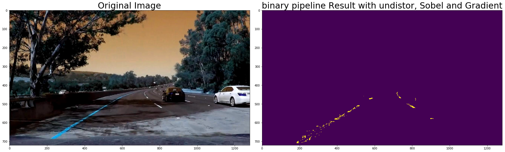
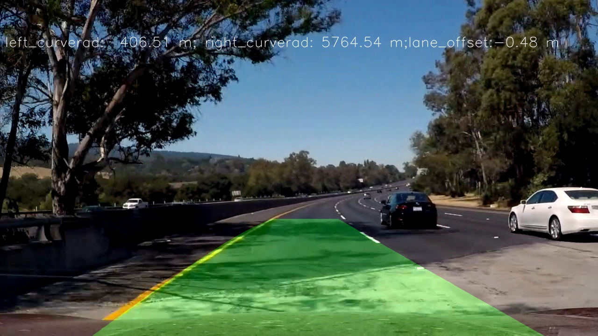

**Advanced Lane Finding Project**

The goals / steps of this project are the following:

* Compute the camera calibration matrix and distortion coefficients given a set of chessboard images.
* Apply a distortion correction to raw images.
* Use color transforms, gradients, etc., to create a thresholded binary image.
* Apply a perspective transform to rectify binary image ("birds-eye view").
* Detect lane pixels and fit to find the lane boundary.
* Determine the curvature of the lane and vehicle position with respect to center.
* Warp the detected lane boundaries back onto the original image.
* Output visual display of the lane boundaries and numerical estimation of lane curvature and vehicle position.

[//]: # (Image References)
[image0]: ./outputs/calibration1.jpg
[image1]: ./outputs/undis_calibration1.jpg "Undistorted"
[image2]: ./outputs/undis_calibration_test2.jpg "Road Transformed"
[image3]: ./examples/binary_combo_example.jpg "Binary Example"
[image4]: ./examples/warped_straight_lines.jpg "Warp Example"
[image5]: ./examples/color_fit_lines.jpg "Fit Visual"
[image6]: ./examples/example_output.jpg "Output"
[video1]: ./project_video.mp4 "Video"

## [Rubric](https://review.udacity.com/#!/rubrics/571/view) Points

### Here I will consider the rubric points individually and describe how I addressed each point in my implementation.  

### Camera Calibration

#### 1. Briefly state how you computed the camera matrix and distortion coefficients. Provide an example of a distortion corrected calibration image.

The code for this step is contained in the first code cell of the IPython notebook located in "./examples/example.ipynb".  

I start by preparing "object points", which will be the (x, y, z) coordinates of the chessboard corners in the world. Here I am assuming the chessboard is fixed on the (x, y) plane at z=0, such that the object points are the same for each calibration image.  Thus, `objp` is just a replicated array of coordinates, and `objpoints` will be appended with a copy of it every time I successfully detect all chessboard corners in a test image.  `imgpoints` will be appended with the (x, y) pixel position of each of the corners in the image plane with each successful chessboard detection.  

I then used the output `objpoints` and `imgpoints` to compute the camera calibration and distortion coefficients using the `cv2.calibrateCamera()` function.  I applied this distortion correction to the test image using the `cv2.undistort()` function and obtained this result: 


### Pipeline (single images)

#### 1. Provide an example of a distortion-corrected image.

once we have camera calibration matrix and distortion matrix obtained from the camera calibration, then make a call to cv2.undistort to get undistorted image. 
First read in an image, make a call to cv2.undistort. the image is either written to file or display in notebook as follows.


```
img = cv2.imread('test_images/test2.jpg')
dst = cv2.undistort(img, mtx, dist, None, mtx)
cv2.imwrite('outputs/undis_calibration_test2.jpg',dst)
```
In the later video frame pipeline, the found ploygon is projected backed onto the undistorted image.

#### 2. Describe how you used color transforms, gradients or other methods to create a thresholded binary image.  Provide an example of a binary image result.

I used a combination of S channel color and L channel x derivative gradient plus thresholds to generate a binary image.  
The code is in the "cell" section of funcation name: ** binary_image_pipeline ** in final_notebook.ipynb

* step 1, call select_yellow to pick yellow pixel. the image is converted to HSV color space and applied the threshold.
```
     lower = np.array([20,60,60])
     upper = np.array([38,174, 250])
```
* step 2, call selet_white to pick while pixel.
   ``` lower = np.array([202,202,202])
       upper = np.array([255,255,255]) 
    ```
* step 3, convert to HLS color space
* step 4, take the derivative in x on l_channel
* step 5, normalize the pixel value into range of (0, 255)
* step 6, apply threshold(20, 100) on l_channel sobel derivative data
* step 7, build combined color image where l channel sobel x derivative is 1, or yellow mask or white mask.
* step 8, apply the region_of_interest to select pixel only interested to lane finding.
          four vertices: [(0,imshape[0]),(525, 432), (750, 432), (imshape[1],imshape[0])]

Here's an example of my output for this step for frame 1037.  (note: this is not actually from one of the test images)


#### 3. Describe how (and identify where in your code) you performed a perspective transform and provide an example of a transformed image.

The code for my perspective transform includes a function called `warper()` in the code cell of the IPython notebook starting ## "Following "warp" function" ## .  The `warper()` function takes as inputs an image (`img`), as well as source (`src`) and destination (`dst`) points.  I chose the hardcode the source and destination points in the following manner:

```python
src = np.float32(
    [[577, 469],
     [723, 469],
     [329, 667],
     [1081, 667]])
dest = np.float32(
     [[320, 0],
      [920, 0],
      [310, 667],
     [950, 667]])
```

This resulted in the following source and destination points:

| Source        | Destination   |  changed to |
|:-------------:|:-------------:|:-------:|
| 577, 469      | 310, 0        | 320, 0 |
| 723, 469      | 950, 0      | 920, 0|
| 329, 667     | 310, 667      | 310, 667 |
| 1081, 667      | 950 , 667        | 950 , 667 | 

The src points are obtained by locating the four points on the picture. calculate the mouse point offset of 78 in "shift+command+4" on Mac
The dest points are fixed around the two centers of histogram: 310 and 950
The four dot are plot back on the original image. the warped image as show as well. 

I verified that my perspective transform was working as expected by drawing the `src` and `dst` points onto a test image and its warped counterpart to verify that the lines appear parallel in the warped image.


Warped image:


#### 4. Describe how you identified lane-line pixels and fit their positions with a polynomial?

I implemented two lane finding algorithms from class materials and use them under conditions.

1. slide window based, which based on the histogram peak points to find out left and right lane x bases. it has 9 windows in height to search all the pixels has none zero from warped image. The center of search box is moving based on the average of x value of points. The function is found in cell: ##frame_lane_detect##

2. prediction based on previous ploy fit parameters. The function is found at: frame_lane_detect_calc
    This founction does not do the sliding window search on pixel for lane. instead, it use previous ploy fit parameter to predict the lane and search pixel to the lane center +/- margin 100 pixels.

Two functions are called based on different conditions:
   * if it is first frame or every 10 frames, then restart the window based lane search by calling frame_lane_detect
   
   * else for current frame, use the privous frame's ploy fit to search the pixels around prejected lane by calling frame_lane_detect_calc
   


#### 5. Describe how you calculated the radius of curvature of the lane and the position of the vehicle with respect to center.

The function ** curverads_centeroff ** in final_notebook.ipynb is used to calculate the left and right curverads. 
Curverads are calculated as following to get the real world number:
   * 1. use the ploy fit coefficiencies to find the all pixel x locations
   * 2. convert the pixel location to real world distance using following fomula:
       * ym_per_pix = 30/720 # meters per pixel in y dimension
       * xm_per_pix = 3.7/700 # meters per pixel in x dimension
   * 3. use polyfit find real world (x, y) to ploynomials
   * 4. use the fomular to calculate the center distance:
   
        

The lane center offset is measured by the image center point on x axis minus the center point between two lanes.
The calculated as follows:
* center point of image on x axis = 1280/2 where 1280 is image width
* center point between two lanes:
    (left_fitx[-1]+right_fitx[-1])/2
* multiply with pixel to real world distance ratio: xm_per_pix
so the final fomula is:
    lane_offset = (1280/2 - (left_fitx[-1]+right_fitx[-1])/2)*xm_per_pix

if value is negative, then car offsets to right.
if value is positive, then car offsets to left.

#### 6. Provide an example image of your result plotted back down onto the road such that the lane area is identified clearly.

I implemented this steps in the final_notebook.ipynb after ** following are testing code for each frame and debug problematic frame. the sequence is same as outlined pipeline_process_frame **:


#### 7. Here are the complete the steps to create the pipeline for each frame in video:

Following function is in defined in cell in final_notebook.ipynb

**pipeline_process_frame**(frame, mtx, dist, M, Minv, i):
```

    1. undistort the image based on the camera calibration matrix mtx, distortion matrix dist.
    2. create binary image uses furction binary_image_pipeline with color transform and gradient x derivative
    3. create warped image based on the persepective transform to get bird eye image
    4. decide with algorithm to call to search lane for an image.
        a) if it is first frame or every 4 frames, then restart the window based lane search by calling frame_lane_detect
        b) else for current frame, use the privous frame's ploy fit search the pixels around prejected lane by calling
    5. smooth the lane coefficiencies with past 10 records.
    6. Warp the detected lane boundaries back onto the original image.
    7. calculate the curverad for both left and right lane.
    8. display the curverads and offset to original image.
    9. return the final result image.
```
---

### Pipeline (video)

#### 1. Provide a link to your final video output.  Pipeline should perform reasonably well on the entire project video.

There some minor wobbly lines but it does not cause catastrophic failure after smoothing lines. 

Here's a [link to my video result](./p4_advanced_lane_smooth.mp4)

---

### Discussion

#### 1. Briefly discuss any problems / issues you faced in your implementation of this project.  Where will your pipeline likely fail?  What could you do to make it more robust?

Here I'll talk about the approach I took, what techniques I used, what worked and why, where the pipeline might fail and how I might improve it if I were going to pursue this project further.  

## First, histogram max will not gurantee to return pleasant lane location start search point center of x
Noticed that right lane histogram peak actually is not the center of lane due to light lane on gound and cause the incorrect ploy fit. the right lane center is put back to start search.
```
if(rightx_base > 1100 or rightx_base < 800):
        rightx_base = 950
```
origin frame 715 in video 
The historgram actually pick the starting x around 1200. the actual lane start point is around 950. 


incorrect lane extended to the right due to bad fit to the car on right right. Histogram max picks wrong point.


After applying the above base determin logic, the correct image projected back:


## second issue is with shadowed lane. particular with frame 1045(now solved)

this time with enhanced binary_image_pipeline described above, this shadowed frame is progress properly. 


Following are old code result to see where was the problem. last time with smoother and old binary pipeline method.


after applying explore the HSV color space for yellow and picking up white color mask, here is the kind of okay lane.


 
** future work if continue when time allowed **

* 1. do further experiments with the color space especially when image has bright ground or shadowed due to strong sunshine. dynamically pick lane search method based on the weather condition.

* 2. build more adaptive lane average algorithm to smooth out lane detection issue.

* 3. check out the challenge vidoe and find out it did not work out on the frames under bridge. Need to explore more on those drive conditions. Read the published paper on the various weather conditions such as cloudy, foggy, raining, night vision etc to predict right lanes.

* 3. find out if the center of radius of circle is dramatically change, i.e. center of circle is moved from far left of lane to right of lane. this means the lane detection is not right. use past average lane detection value for current frame.

frame 1037 has been solved with latest **binary_image_pipeline** flow:

Original image frame 1037:


old code generated the warped and predicted lane without smoothing lane polynomials:


old code for lane with smoothed lane with past 10 lanes.



Latest code ** binary_image_pipeline** works for frame: the lane find find right lane. no high need bet on the smoother.


